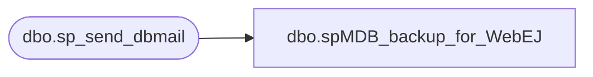

# dbo.spMDB_backup_for_WebEJ

**Database:** EJ  
**Server:** bedrockdb02  

## Architecture Diagram



## Table Dependencies

| Referenced Table |
|---|
| dbo.sp_send_dbmail |

## Stored Procedure Code

```sql

```

