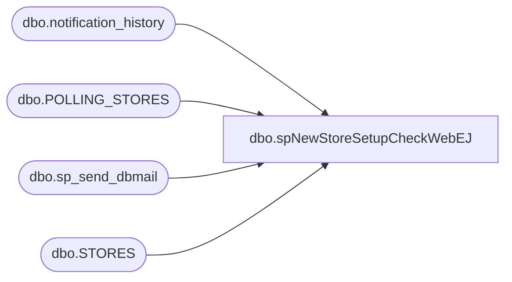

# dbo.spNewStoreSetupCheckWebEJ

**Database:** EJ  
**Server:** bedrockdb02  

## Architecture Diagram



## Table Dependencies

| Referenced Table |
|---|
| dbo.notification_history |
| dbo.POLLING_STORES |
| dbo.sp_send_dbmail |
| dbo.STORES |

## Stored Procedure Code

```sql

```

