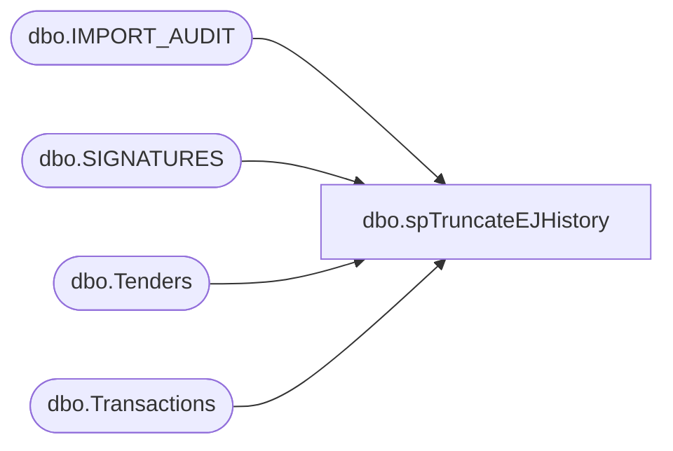

# dbo.spTruncateEJHistory

**Database:** EJ  
**Server:** bedrockdb02  

## Architecture Diagram



## Table Dependencies

| Referenced Table |
|---|
| dbo.IMPORT_AUDIT |
| dbo.SIGNATURES |
| dbo.Tenders |
| dbo.Transactions |

## Stored Procedure Code

```sql

```

