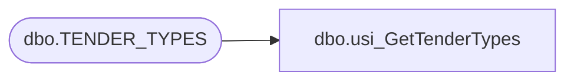

# dbo.usi_GetTenderTypes

**Database:** EJ  
**Server:** bedrockdb02  

## Architecture Diagram



## Table Dependencies

| Referenced Table |
|---|
| dbo.TENDER_TYPES |

## Stored Procedure Code

```sql

```

