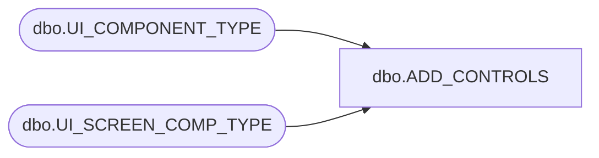

# dbo.ADD_CONTROLS

**Database:** POSCONFIG  
**Server:** bedrockdb02  

## Architecture Diagram



## Table Dependencies

| Referenced Table |
|---|
| dbo.UI_COMPONENT_TYPE |
| dbo.UI_SCREEN_COMP_TYPE |

## Stored Procedure Code

```sql

```

