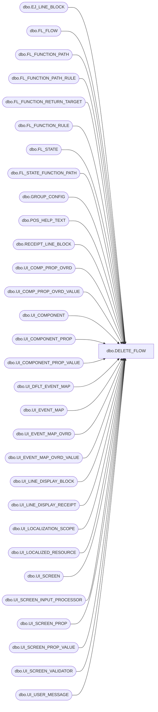

# dbo.DELETE_FLOW

**Database:** POSCONFIG  
**Server:** bedrockdb02  

## Architecture Diagram



## Table Dependencies

| Referenced Table |
|---|
| dbo.EJ_LINE_BLOCK |
| dbo.FL_FLOW |
| dbo.FL_FUNCTION_PATH |
| dbo.FL_FUNCTION_PATH_RULE |
| dbo.FL_FUNCTION_RETURN_TARGET |
| dbo.FL_FUNCTION_RULE |
| dbo.FL_STATE |
| dbo.FL_STATE_FUNCTION_PATH |
| dbo.GROUP_CONFIG |
| dbo.POS_HELP_TEXT |
| dbo.RECEIPT_LINE_BLOCK |
| dbo.UI_COMP_PROP_OVRD |
| dbo.UI_COMP_PROP_OVRD_VALUE |
| dbo.UI_COMPONENT |
| dbo.UI_COMPONENT_PROP |
| dbo.UI_COMPONENT_PROP_VALUE |
| dbo.UI_DFLT_EVENT_MAP |
| dbo.UI_EVENT_MAP |
| dbo.UI_EVENT_MAP_OVRD |
| dbo.UI_EVENT_MAP_OVRD_VALUE |
| dbo.UI_LINE_DISPLAY_BLOCK |
| dbo.UI_LINE_DISPLAY_RECEIPT |
| dbo.UI_LOCALIZATION_SCOPE |
| dbo.UI_LOCALIZED_RESOURCE |
| dbo.UI_SCREEN |
| dbo.UI_SCREEN_INPUT_PROCESSOR |
| dbo.UI_SCREEN_PROP |
| dbo.UI_SCREEN_PROP_VALUE |
| dbo.UI_SCREEN_VALIDATOR |
| dbo.UI_USER_MESSAGE |

## Stored Procedure Code

```sql

```

