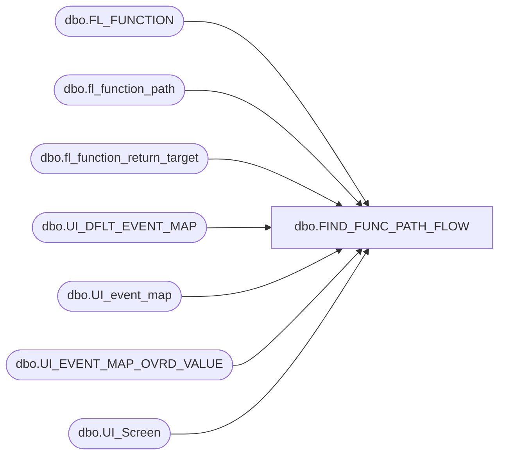

# dbo.FIND_FUNC_PATH_FLOW

**Database:** POSCONFIG  
**Server:** bedrockdb02  

## Architecture Diagram



## Table Dependencies

| Referenced Table |
|---|
| dbo.FL_FUNCTION |
| dbo.fl_function_path |
| dbo.fl_function_return_target |
| dbo.UI_DFLT_EVENT_MAP |
| dbo.UI_event_map |
| dbo.UI_EVENT_MAP_OVRD_VALUE |
| dbo.UI_Screen |

## Stored Procedure Code

```sql

```

