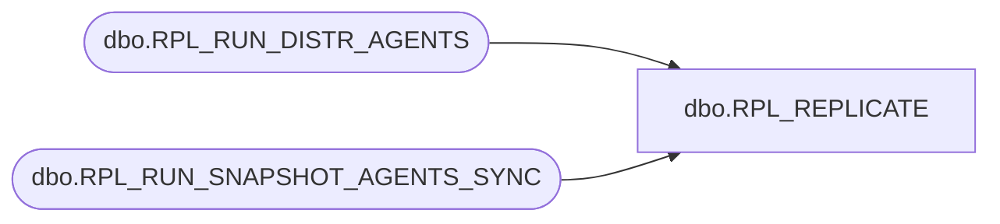

# dbo.RPL_REPLICATE

**Database:** POSCONFIG  
**Server:** bedrockdb02  

## Architecture Diagram



## Table Dependencies

| Referenced Table |
|---|
| dbo.RPL_RUN_DISTR_AGENTS |
| dbo.RPL_RUN_SNAPSHOT_AGENTS_SYNC |

## Stored Procedure Code

```sql

```

