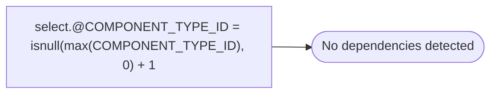

# select.@COMPONENT_TYPE_ID = isnull(max(COMPONENT_TYPE_ID), 0) + 1

**Database:** POSCONFIG  
**Server:** bedrockdb02  

## Architecture Diagram



## Table Dependencies

_No table references detected._

## Stored Procedure Code

```sql

```

