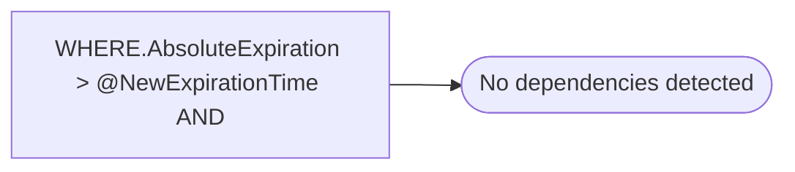

# WHERE.AbsoluteExpiration > @NewExpirationTime AND

**Database:** ReportServerES  
**Server:** bedrockdb02  

## Architecture Diagram



## Table Dependencies

_No table references detected._

## Stored Procedure Code

```sql

```

