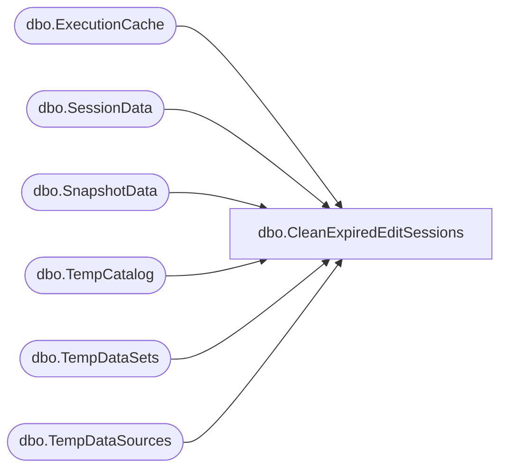

# dbo.CleanExpiredEditSessions

**Database:** ReportServerES  
**Server:** bedrockdb02  

## Architecture Diagram



## Table Dependencies

| Referenced Table |
|---|
| dbo.ExecutionCache |
| dbo.SessionData |
| dbo.SnapshotData |
| dbo.TempCatalog |
| dbo.TempDataSets |
| dbo.TempDataSources |

## Stored Procedure Code

```sql

```

