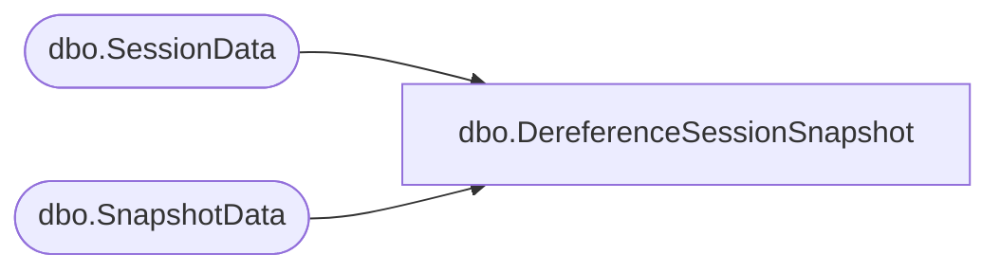

# dbo.DereferenceSessionSnapshot

**Database:** ReportServerES  
**Server:** bedrockdb02  

## Architecture Diagram



## Table Dependencies

| Referenced Table |
|---|
| dbo.SessionData |
| dbo.SnapshotData |

## Stored Procedure Code

```sql

```

