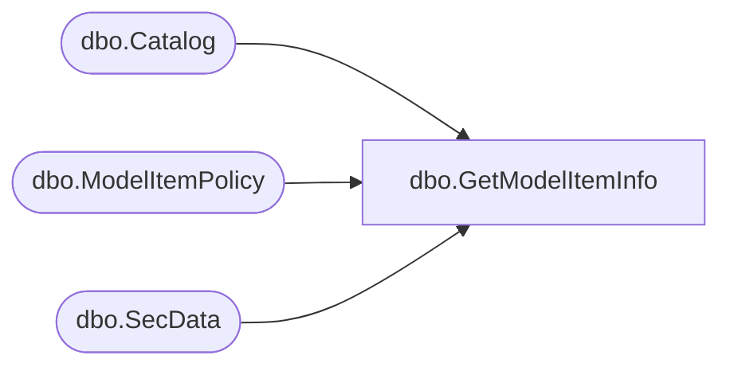

# dbo.GetModelItemInfo

**Database:** ReportServerES  
**Server:** bedrockdb02  

## Architecture Diagram



## Table Dependencies

| Referenced Table |
|---|
| dbo.Catalog |
| dbo.ModelItemPolicy |
| dbo.SecData |

## Stored Procedure Code

```sql

```

