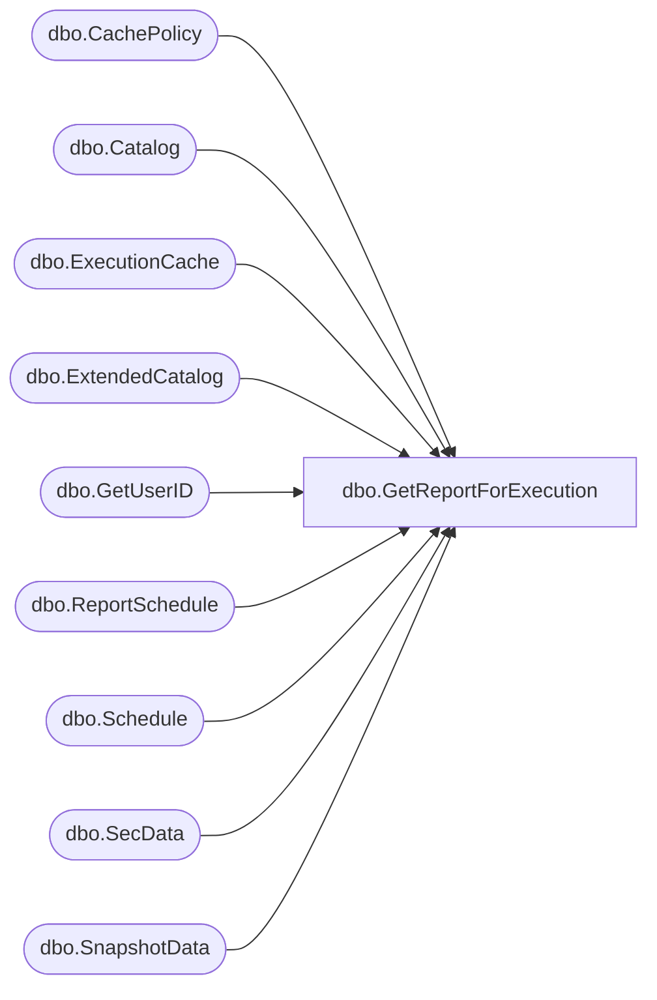

# dbo.GetReportForExecution

**Database:** ReportServerES  
**Server:** bedrockdb02  

## Architecture Diagram



## Table Dependencies

| Referenced Table |
|---|
| dbo.CachePolicy |
| dbo.Catalog |
| dbo.ExecutionCache |
| dbo.ExtendedCatalog |
| dbo.GetUserID |
| dbo.ReportSchedule |
| dbo.Schedule |
| dbo.SecData |
| dbo.SnapshotData |

## Stored Procedure Code

```sql

```

