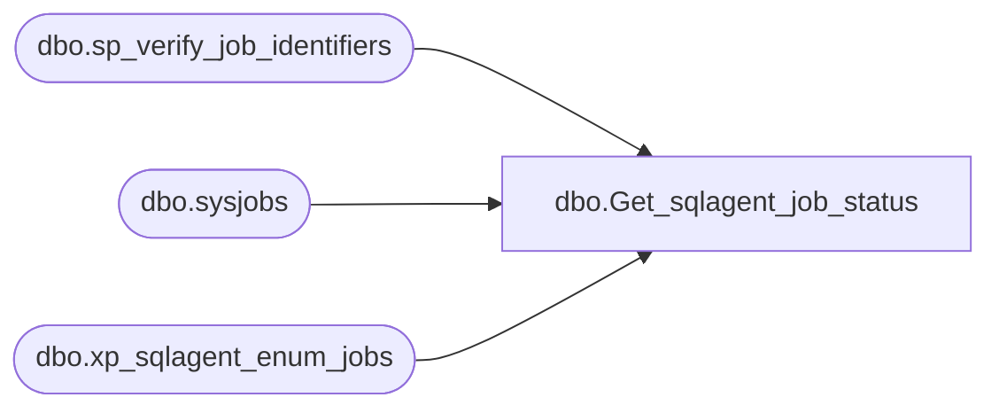

# dbo.Get_sqlagent_job_status

**Database:** ReportServerES  
**Server:** bedrockdb02  

## Architecture Diagram



## Table Dependencies

| Referenced Table |
|---|
| dbo.sp_verify_job_identifiers |
| dbo.sysjobs |
| dbo.xp_sqlagent_enum_jobs |

## Stored Procedure Code

```sql

```

