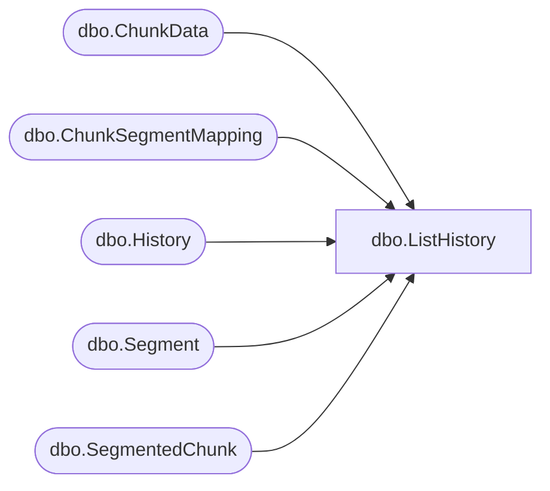

# dbo.ListHistory

**Database:** ReportServerES  
**Server:** bedrockdb02  

## Architecture Diagram



## Table Dependencies

| Referenced Table |
|---|
| dbo.ChunkData |
| dbo.ChunkSegmentMapping |
| dbo.History |
| dbo.Segment |
| dbo.SegmentedChunk |

## Stored Procedure Code

```sql

```

