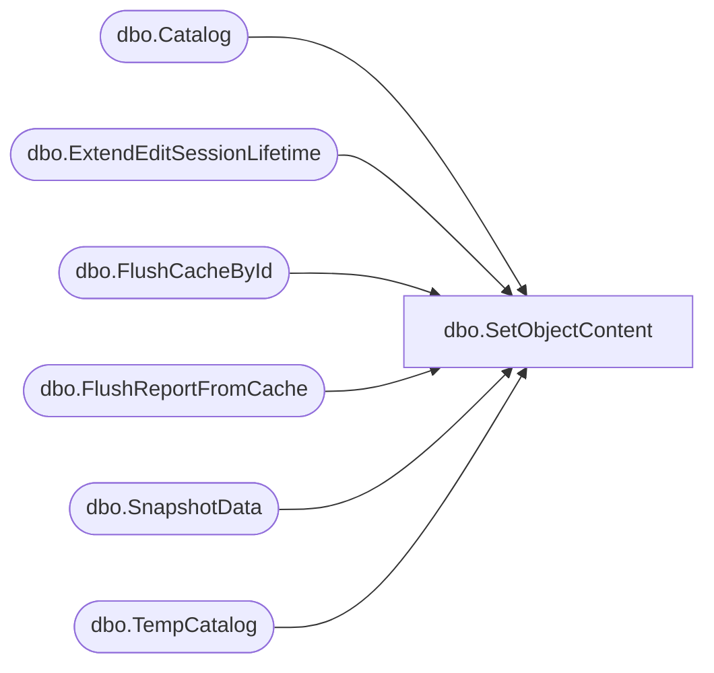

# dbo.SetObjectContent

**Database:** ReportServerES  
**Server:** bedrockdb02  

## Architecture Diagram



## Table Dependencies

| Referenced Table |
|---|
| dbo.Catalog |
| dbo.ExtendEditSessionLifetime |
| dbo.FlushCacheById |
| dbo.FlushReportFromCache |
| dbo.SnapshotData |
| dbo.TempCatalog |

## Stored Procedure Code

```sql

```

