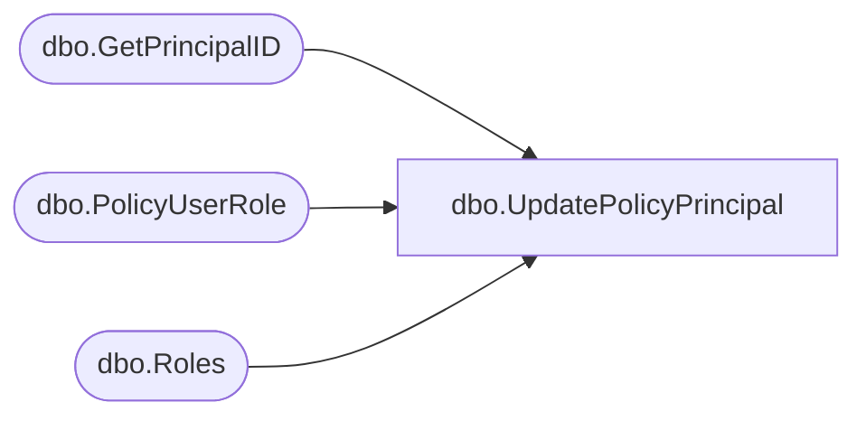

# dbo.UpdatePolicyPrincipal

**Database:** ReportServerES  
**Server:** bedrockdb02  

## Architecture Diagram



## Table Dependencies

| Referenced Table |
|---|
| dbo.GetPrincipalID |
| dbo.PolicyUserRole |
| dbo.Roles |

## Stored Procedure Code

```sql

```

