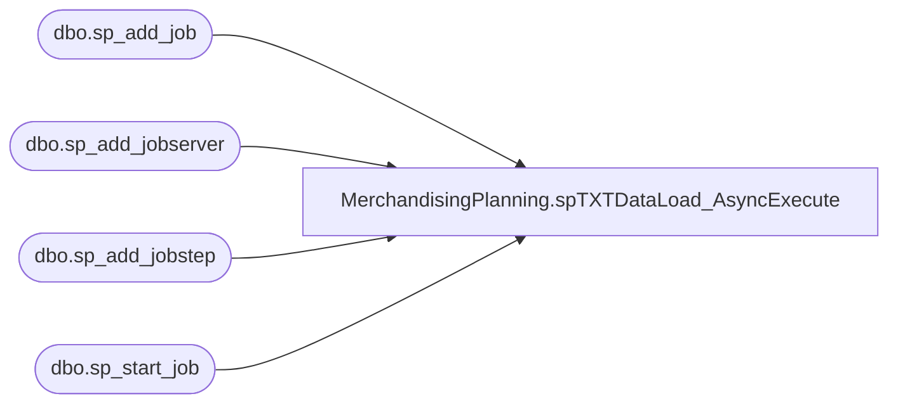

# MerchandisingPlanning.spTXTDataLoad_AsyncExecute

**Database:** TXTStaging  
**Server:** bedrockdb02  

## Architecture Diagram



## Table Dependencies

| Referenced Table |
|---|
| dbo.sp_add_job |
| dbo.sp_add_jobserver |
| dbo.sp_add_jobstep |
| dbo.sp_start_job |

## Stored Procedure Code

```sql

```

