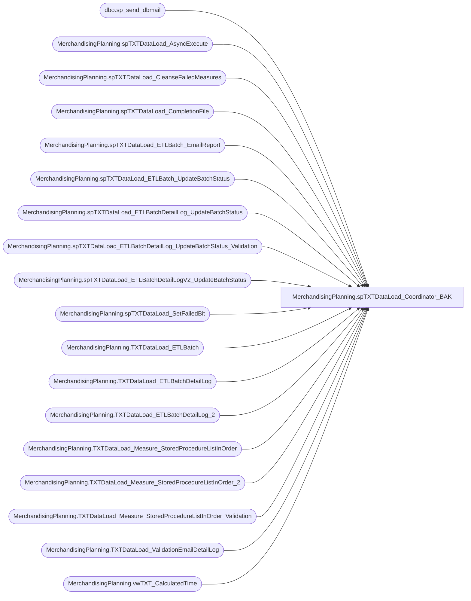

# MerchandisingPlanning.spTXTDataLoad_Coordinator_BAK

**Database:** TXTStaging  
**Server:** bedrockdb02  

## Architecture Diagram



## Table Dependencies

| Referenced Table |
|---|
| dbo.sp_send_dbmail |
| MerchandisingPlanning.spTXTDataLoad_AsyncExecute |
| MerchandisingPlanning.spTXTDataLoad_CleanseFailedMeasures |
| MerchandisingPlanning.spTXTDataLoad_CompletionFile |
| MerchandisingPlanning.spTXTDataLoad_ETLBatch_EmailReport |
| MerchandisingPlanning.spTXTDataLoad_ETLBatch_UpdateBatchStatus |
| MerchandisingPlanning.spTXTDataLoad_ETLBatchDetailLog_UpdateBatchStatus |
| MerchandisingPlanning.spTXTDataLoad_ETLBatchDetailLog_UpdateBatchStatus_Validation |
| MerchandisingPlanning.spTXTDataLoad_ETLBatchDetailLogV2_UpdateBatchStatus |
| MerchandisingPlanning.spTXTDataLoad_SetFailedBit |
| MerchandisingPlanning.TXTDataLoad_ETLBatch |
| MerchandisingPlanning.TXTDataLoad_ETLBatchDetailLog |
| MerchandisingPlanning.TXTDataLoad_ETLBatchDetailLog_2 |
| MerchandisingPlanning.TXTDataLoad_Measure_StoredProcedureListInOrder |
| MerchandisingPlanning.TXTDataLoad_Measure_StoredProcedureListInOrder_2 |
| MerchandisingPlanning.TXTDataLoad_Measure_StoredProcedureListInOrder_Validation |
| MerchandisingPlanning.TXTDataLoad_ValidationEmailDetailLog |
| MerchandisingPlanning.vwTXT_CalculatedTime |

## Stored Procedure Code

```sql

```

