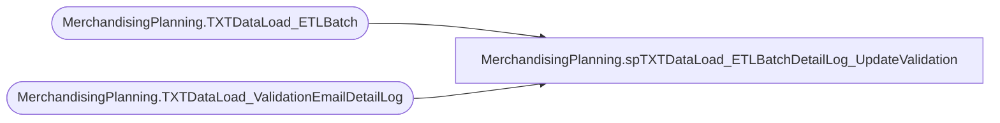

# MerchandisingPlanning.spTXTDataLoad_ETLBatchDetailLog_UpdateValidation

**Database:** TXTStaging  
**Server:** bedrockdb02  

## Architecture Diagram



## Table Dependencies

| Referenced Table |
|---|
| MerchandisingPlanning.TXTDataLoad_ETLBatch |
| MerchandisingPlanning.TXTDataLoad_ValidationEmailDetailLog |

## Stored Procedure Code

```sql

```

