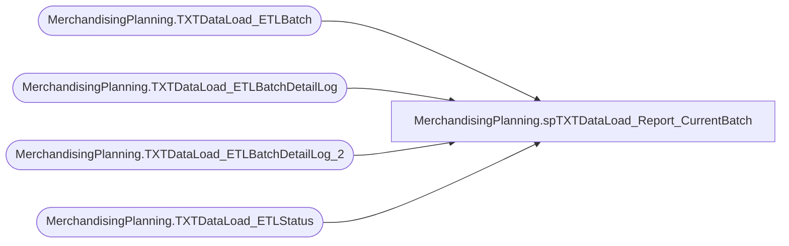

# MerchandisingPlanning.spTXTDataLoad_Report_CurrentBatch

**Database:** TXTStaging  
**Server:** bedrockdb02  

## Architecture Diagram



## Table Dependencies

| Referenced Table |
|---|
| MerchandisingPlanning.TXTDataLoad_ETLBatch |
| MerchandisingPlanning.TXTDataLoad_ETLBatchDetailLog |
| MerchandisingPlanning.TXTDataLoad_ETLBatchDetailLog_2 |
| MerchandisingPlanning.TXTDataLoad_ETLStatus |

## Stored Procedure Code

```sql

```

