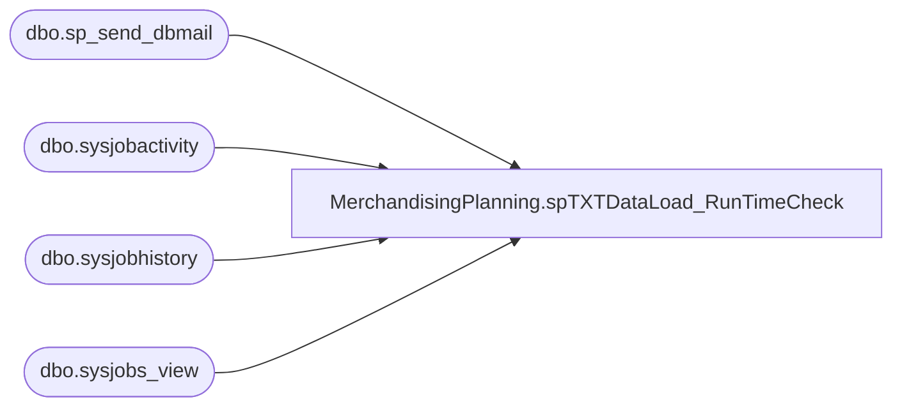

# MerchandisingPlanning.spTXTDataLoad_RunTimeCheck

**Database:** TXTStaging  
**Server:** bedrockdb02  

## Architecture Diagram



## Table Dependencies

| Referenced Table |
|---|
| dbo.sp_send_dbmail |
| dbo.sysjobactivity |
| dbo.sysjobhistory |
| dbo.sysjobs_view |

## Stored Procedure Code

```sql
-- =============================================
```

