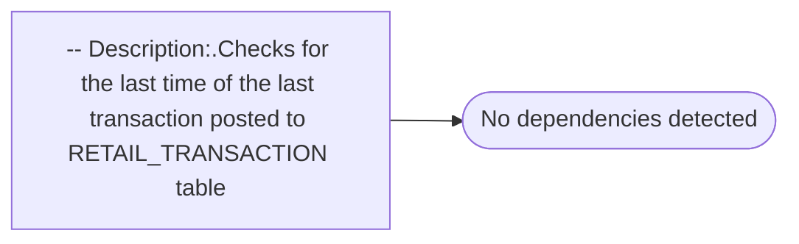

# -- Description:.Checks for the last time of the last transaction posted to RETAIL_TRANSACTION table

**Database:** USICOAL  
**Server:** bedrockdb02  

## Architecture Diagram



## Table Dependencies

_No table references detected._

## Stored Procedure Code

```sql

```

