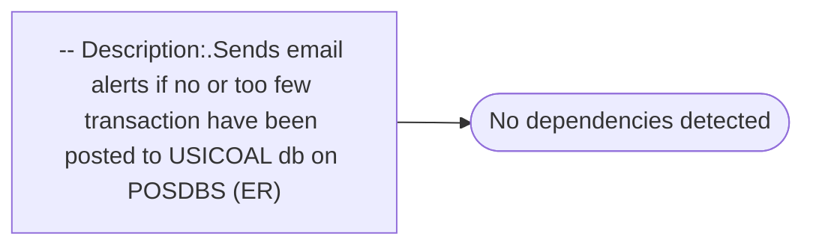

# -- Description:.Sends email alerts if no or too few transaction have been posted to USICOAL db on POSDBS (ER)

**Database:** USICOAL  
**Server:** bedrockdb02  

## Architecture Diagram



## Table Dependencies

_No table references detected._

## Stored Procedure Code

```sql

```

