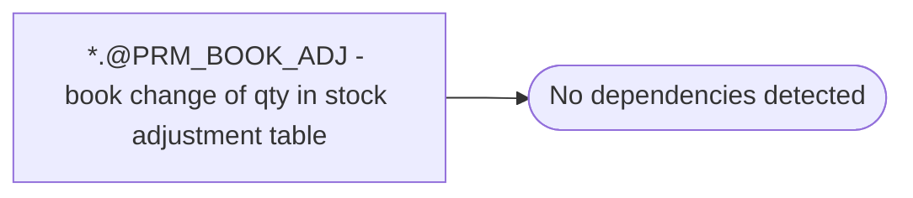

# *.@PRM_BOOK_ADJ - book change of qty in stock adjustment table

**Database:** USICOAL  
**Server:** bedrockdb02  

## Architecture Diagram



## Table Dependencies

_No table references detected._

## Stored Procedure Code

```sql

```

