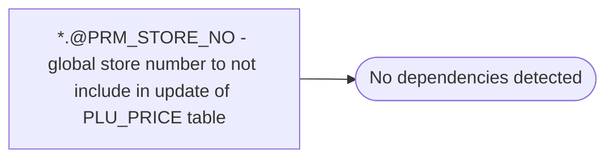

# *.@PRM_STORE_NO - global store number to not include in update of PLU_PRICE table

**Database:** USICOAL  
**Server:** bedrockdb02  

## Architecture Diagram



## Table Dependencies

_No table references detected._

## Stored Procedure Code

```sql

```

