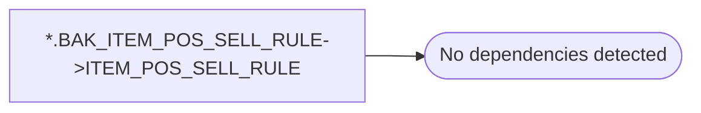

# *.BAK_ITEM_POS_SELL_RULE->ITEM_POS_SELL_RULE

**Database:** USICOAL  
**Server:** bedrockdb02  

## Architecture Diagram



## Table Dependencies

_No table references detected._

## Stored Procedure Code

```sql

```

