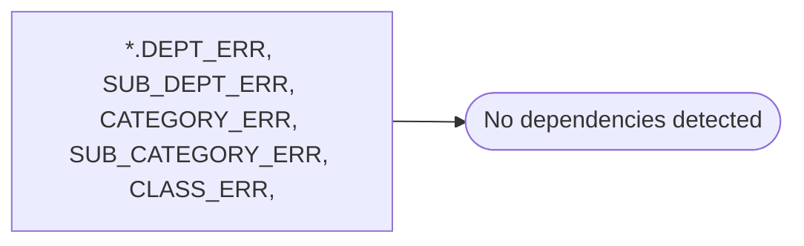

# *.DEPT_ERR, SUB_DEPT_ERR, CATEGORY_ERR, SUB_CATEGORY_ERR, CLASS_ERR,

**Database:** USICOAL  
**Server:** bedrockdb02  

## Architecture Diagram



## Table Dependencies

_No table references detected._

## Stored Procedure Code

```sql

```

