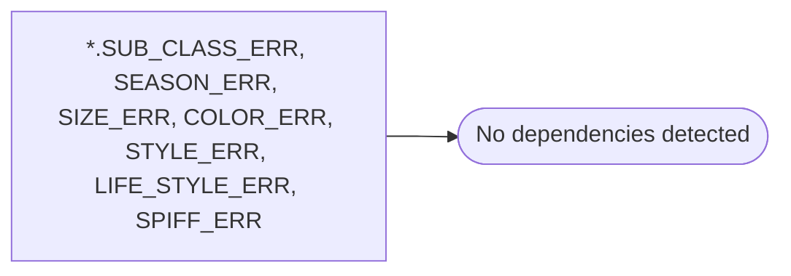

# *.SUB_CLASS_ERR, SEASON_ERR, SIZE_ERR, COLOR_ERR, STYLE_ERR, LIFE_STYLE_ERR, SPIFF_ERR

**Database:** USICOAL  
**Server:** bedrockdb02  

## Architecture Diagram



## Table Dependencies

_No table references detected._

## Stored Procedure Code

```sql

```

