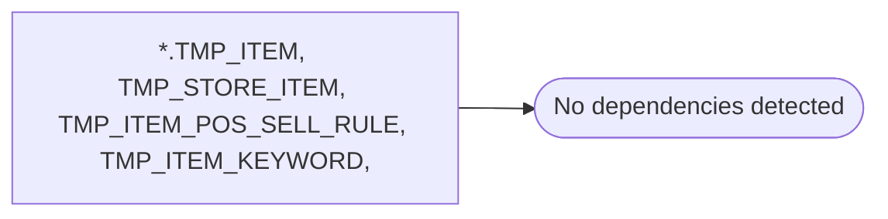

# *.TMP_ITEM, TMP_STORE_ITEM, TMP_ITEM_POS_SELL_RULE, TMP_ITEM_KEYWORD,

**Database:** USICOAL  
**Server:** bedrockdb02  

## Architecture Diagram



## Table Dependencies

_No table references detected._

## Stored Procedure Code

```sql

```

