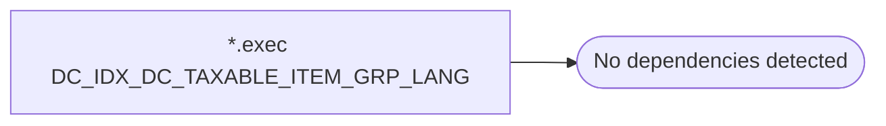

# *.exec DC_IDX_DC_TAXABLE_ITEM_GRP_LANG

**Database:** USICOAL  
**Server:** bedrockdb02  

## Architecture Diagram



## Table Dependencies

_No table references detected._

## Stored Procedure Code

```sql

```

