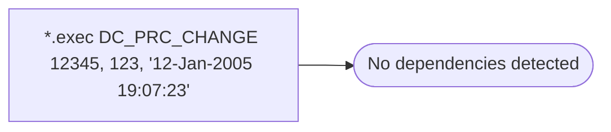

# *.exec DC_PRC_CHANGE 12345, 123, '12-Jan-2005 19:07:23'

**Database:** USICOAL  
**Server:** bedrockdb02  

## Architecture Diagram



## Table Dependencies

_No table references detected._

## Stored Procedure Code

```sql

```

