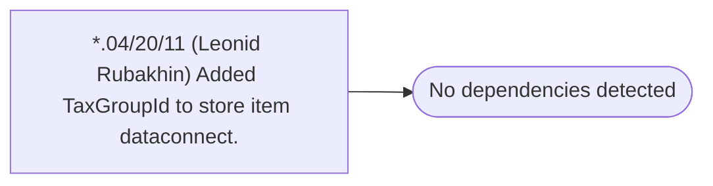

# *.04/20/11 (Leonid Rubakhin) Added TaxGroupId to store item dataconnect.

**Database:** USICOAL  
**Server:** bedrockdb02  

## Architecture Diagram



## Table Dependencies

_No table references detected._

## Stored Procedure Code

```sql

```

