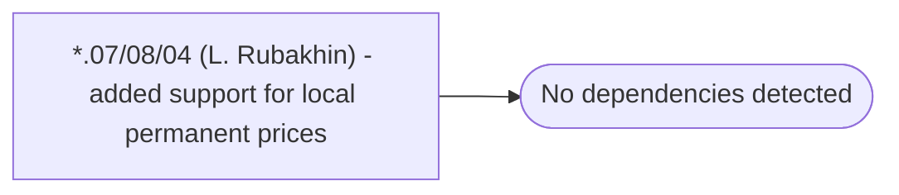

# *.07/08/04 (L. Rubakhin) - added support for local permanent prices

**Database:** USICOAL  
**Server:** bedrockdb02  

## Architecture Diagram



## Table Dependencies

_No table references detected._

## Stored Procedure Code

```sql

```

