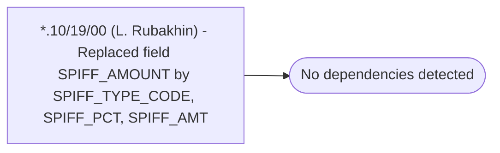

# *.10/19/00 (L. Rubakhin) - Replaced field SPIFF_AMOUNT by SPIFF_TYPE_CODE, SPIFF_PCT, SPIFF_AMT

**Database:** USICOAL  
**Server:** bedrockdb02  

## Architecture Diagram



## Table Dependencies

_No table references detected._

## Stored Procedure Code

```sql

```

