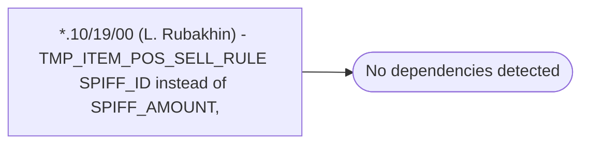

# *.10/19/00 (L. Rubakhin) - TMP_ITEM_POS_SELL_RULE SPIFF_ID instead of SPIFF_AMOUNT,

**Database:** USICOAL  
**Server:** bedrockdb02  

## Architecture Diagram



## Table Dependencies

_No table references detected._

## Stored Procedure Code

```sql

```

