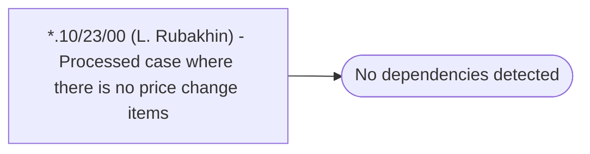

# *.10/23/00 (L. Rubakhin) - Processed case where there is no price change items

**Database:** USICOAL  
**Server:** bedrockdb02  

## Architecture Diagram



## Table Dependencies

_No table references detected._

## Stored Procedure Code

```sql

```

