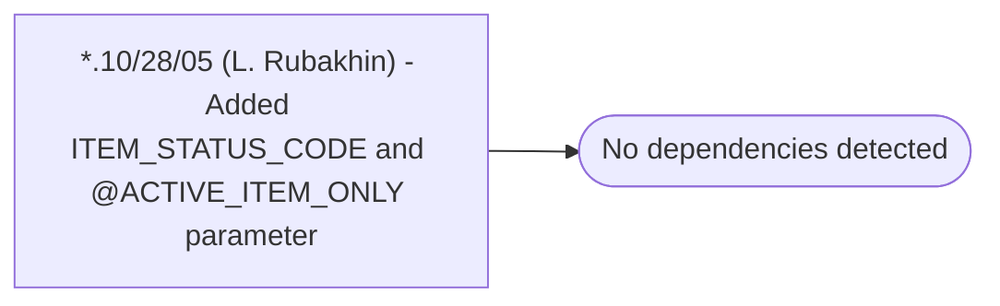

# *.10/28/05 (L. Rubakhin) - Added ITEM_STATUS_CODE and @ACTIVE_ITEM_ONLY parameter

**Database:** USICOAL  
**Server:** bedrockdb02  

## Architecture Diagram



## Table Dependencies

_No table references detected._

## Stored Procedure Code

```sql

```

