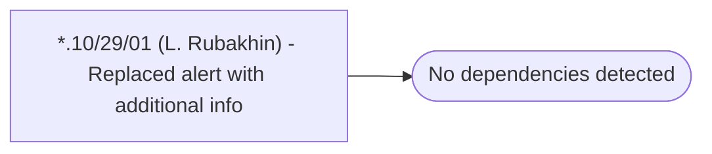

# *.10/29/01 (L. Rubakhin) - Replaced alert with additional info

**Database:** USICOAL  
**Server:** bedrockdb02  

## Architecture Diagram



## Table Dependencies

_No table references detected._

## Stored Procedure Code

```sql

```

