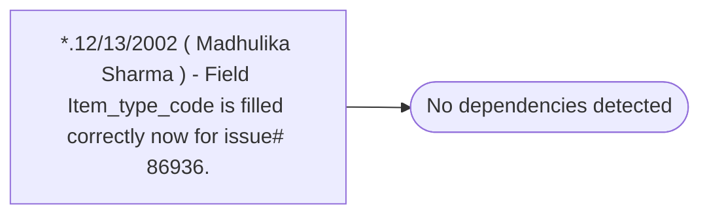

# *.12/13/2002 ( Madhulika Sharma ) - Field Item_type_code is filled correctly now for issue# 86936.

**Database:** USICOAL  
**Server:** bedrockdb02  

## Architecture Diagram



## Table Dependencies

_No table references detected._

## Stored Procedure Code

```sql

```

