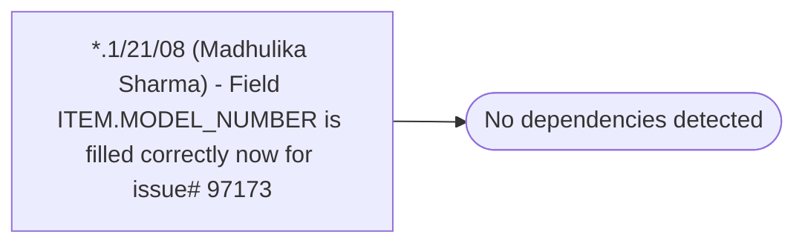

# *.1/21/08 (Madhulika Sharma) - Field ITEM.MODEL_NUMBER is filled correctly now for issue# 97173

**Database:** USICOAL  
**Server:** bedrockdb02  

## Architecture Diagram



## Table Dependencies

_No table references detected._

## Stored Procedure Code

```sql

```

