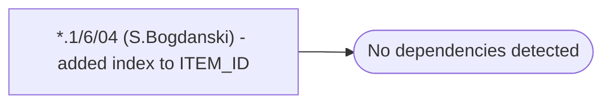

# *.1/6/04 (S.Bogdanski) - added index to ITEM_ID

**Database:** USICOAL  
**Server:** bedrockdb02  

## Architecture Diagram



## Table Dependencies

_No table references detected._

## Stored Procedure Code

```sql

```

