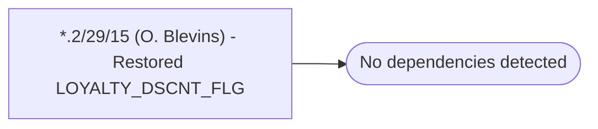

# *.2/29/15 (O. Blevins) - Restored LOYALTY_DSCNT_FLG

**Database:** USICOAL  
**Server:** bedrockdb02  

## Architecture Diagram



## Table Dependencies

_No table references detected._

## Stored Procedure Code

```sql

```

