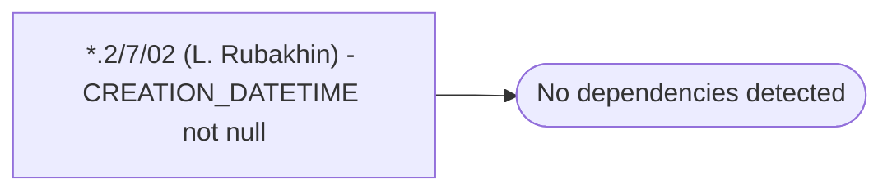

# *.2/7/02 (L. Rubakhin) - CREATION_DATETIME not null

**Database:** USICOAL  
**Server:** bedrockdb02  

## Architecture Diagram



## Table Dependencies

_No table references detected._

## Stored Procedure Code

```sql

```

