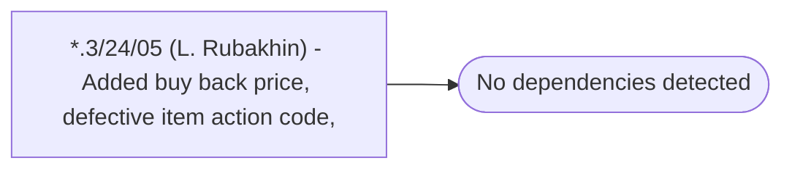

# *.3/24/05 (L. Rubakhin) - Added buy back price, defective item action code,

**Database:** USICOAL  
**Server:** bedrockdb02  

## Architecture Diagram



## Table Dependencies

_No table references detected._

## Stored Procedure Code

```sql

```

