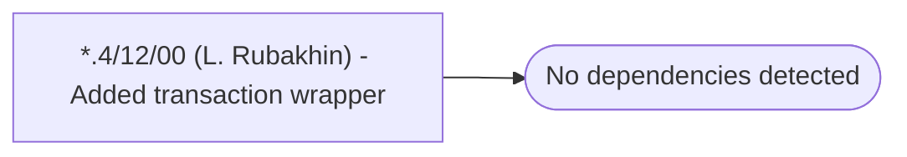

# *.4/12/00 (L. Rubakhin) - Added transaction wrapper

**Database:** USICOAL  
**Server:** bedrockdb02  

## Architecture Diagram



## Table Dependencies

_No table references detected._

## Stored Procedure Code

```sql

```

