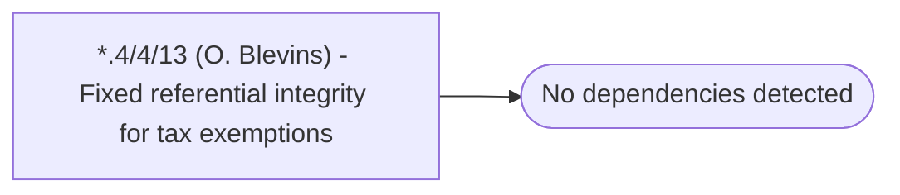

# *.4/4/13 (O. Blevins) - Fixed referential integrity for tax exemptions

**Database:** USICOAL  
**Server:** bedrockdb02  

## Architecture Diagram



## Table Dependencies

_No table references detected._

## Stored Procedure Code

```sql

```

