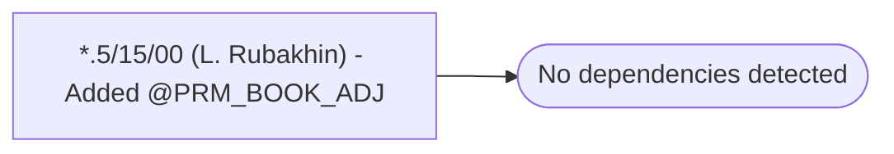

# *.5/15/00 (L. Rubakhin) - Added @PRM_BOOK_ADJ

**Database:** USICOAL  
**Server:** bedrockdb02  

## Architecture Diagram



## Table Dependencies

_No table references detected._

## Stored Procedure Code

```sql

```

