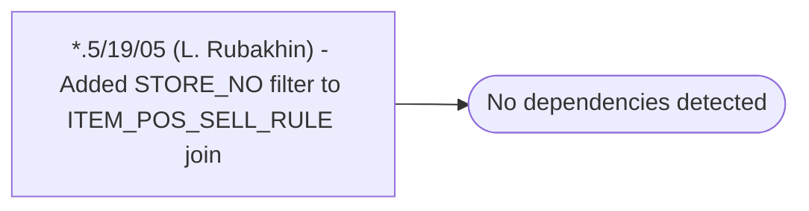

# *.5/19/05 (L. Rubakhin) - Added STORE_NO filter to ITEM_POS_SELL_RULE join

**Database:** USICOAL  
**Server:** bedrockdb02  

## Architecture Diagram



## Table Dependencies

_No table references detected._

## Stored Procedure Code

```sql

```

